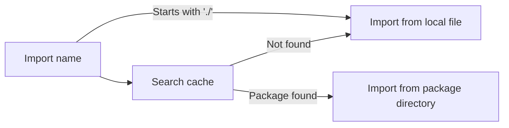
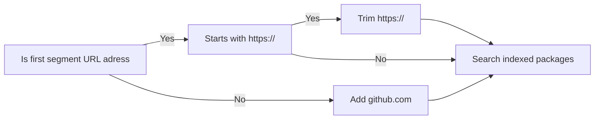

# Intro to the v2 version of CaffeineC
The v2 major release of CaffeineC brought a ton of new features and bug fixes

# If you are new to CaffeineC
If you are new to CaffeineC, I would recommend looking at the [**wiki**](https://c.vypal.me) for a more hands-on tutorial, and an installation guide.

## Basics
### Data types
CaffeineC has a limited amount of builtin data types. These are limited to the couple types that are actually needed. All other types can be defined with these types or by combining them in a [**class**]().

#### Integers
There are two types of integers: signed and unsigned. Both types can have (in theory) any bit size. The format for the integer types is a lowercase `i` for signed integers (or a lowercase `u` for unsigned integers), next a number which defines the bit size. Common values might be 1 (boolean), 8, 32, 64, ... 

#### Floating point numbers
Floating point numbers (floats for short) are defined using a lowercase `f` followed by the bit size. This time (unlike integers) there are only 4 possible bit sizes: 16, 32, 64 and 128 bit floating point numbers are possible.

#### Void
Void is a simple type, it stands for nothing.

#### Pointers
Any data type can also be converted into a pointer to the place where it is stored in memory. To make a type into a pointer type, simply add `*` before the type name, and yes, you can include multiple `*` after each other.

A frequent usage of pointers is the `*i8` type which is a pointer to an 8-bit integer and this is used instead of a `string` or `char` data type.

#### Custom data types
To create a custom data type a class has to be defined, you can learn how to do that [**here**]()

### Functions
Functions are an important concept. Since [CaffeineC switched to OOP]() all your main code must be defined in a main function. Functions follow a syntax similair to golang with the exception of the curly braces:
```go
func main() {

}
```

To give the function a return type, we use a syntax similair to typescript or python:
```go
func main(): i32 {
  return 0;
}
```
This makes the return type a 32-bit signed integer. This also means that we need to add a return statement with a value to return. 

**IMPORTANT** 

The main function can have a `void` return type, but `i32` is recommended. When returning an `i32`, the number returned will be the program's return code, so if everything went well return 0 for other cases maybe check [**this page**](https://www.networkworld.com/article/1286499/understanding-exit-codes-on-linux.html)

### Variables
Variables are defined in a way similair to typescript with a bit of golang:
```ts
var variable: i32 = 0;
```
This defines a new variable called `variable` with a type of `i32` and a value of `0`. The initilaizer (`= 0`) is not necessary. If it is not included, the default null value for the type will be used. 

**WARNING**

The default null value for the data type may be different on different operating systems.

### Classes
Classes are useful for organizing functions and variables that belong together. Classes can have any number of fields, which are variables that are stored as a part of the classes custom data type. Fields can later be accessed from within the class using the `this` keyword, or externally using the classes instance.

Classes can also have any number of methods. Methods are functions that have access to the classes fields using the `this` keyword. The method name `constructor` is reserved for the classes constructor. This method is not required, but when present it will be called when create a new instance of the class.

```ts
class Class {
  a: i32;
  b: i32;

  func constructor(a: i32, b: i32) {
    this.a = a;
    this.b = b;
  }

  func add(): i32 {
    return this.a + this.b;
  }
}
```
This makes a new class named `Class` with two fields `a` and `b` which are both `i32` and a constructor and `add` method.

## Advanced concepts
### Using external functions
CaffeineC has the option to use external functions from C, C++, object files or other CaffeineC files. To be able to use them you have to provide a definition of the external function using the `extern func` statement, which has the follwoing syntax:
```go
extern vararg func printf(fmt: *i8): i32;
```
This defines the binding for the `printf` function from the C standard library. The `vararg` keyword means that the function is a variable-argument function and it accepts an undefined ammount of arguments after the defined ones. This function also accepts a positional argument called `fmt` (short for format) which is an `*i8` and returns a `i32`.

### Exporting functions and classes
To be able to use functions and classes from a CaffeineC file in another CaffeineC file or from another programming language, the function or class has to be exported. The process is extremely simple, just add the `export` keyword before the function or class that you want to export.

## Making a new project
CaffeineC v2 has a new command that allows you to easily make a new prject. So to create a new project just run:
```bash
CaffeineC init (project-name)
```
Replacing `(project-name)` with the name for the project. The program will ask you a couple questions about the new project and will then create a new folder with the name that you chose. When it is finished, it will print a small banner telling you what do to next.

### Adding libraries
To make development easier, CaffeineC v2 now has the option to use other packages as libraries in your project. To download a library, simply run the install command while supplying a url to a git repository containing the package to be downloaded:
```bash
CaffeineC install vyPal/cffc-std
```
This will download the library located at **https://github.com/vyPal/cffc-std** which is currently the "official" standard library. Once the download is done, it will create a package index for fast access. It will also build the library to save time when building the project itself.

To install a specific version of the library you can specify the branch to download from after a @:
```bash
CaffeineC install vyPal/cffc-std@main
```

### Using the libraries in our code
If we open up the `main.cffc` file which was generated automatically, we can replace the `extern func` statement at the top with an import of the standard library:
```diff
package main;

-extern func printf(format: *i8): void;
+import "vyPal/cffc-std/io";

func main(): i64 {
    printf("Hello, world!\n");
    return 0;
}
```

This imports the `io.cffc` file from the `github.com/vyPal/cffc-std` library.

Notice that the `io.cffc` file is located in the `src/` directory of the library, but since the library's cfconf.yaml defines `src/` as the source directory, you do not have to specify it when importing.

### Building the program
To finis our little project all we need to do now is build it. The easiest way to do this is to run the `CaffeineC build` command in the root directory of the project. This will find the project's `cfconf.yaml` file and use it to find the main file (`main.cffc` by default). The output of the build command is a `output` executable file (or `output.exe` on windows). Once you have run the command and it compiled without any errors, you can run the executable file by typing `./output` (or `./output.exe` on windows) to see a `Hello, World!` message in your command line.

If you want to build and run the program with one command, run `CaffeineC run` instead. This will build the executable and automatically run it. 

The compiler is pretty fast, but can be made even faster. If you are interessed in more speed improvements, check out the [**Optimizing the compiler**](https://c.vypal.me/advanced-principles/optimizing-the-compiler) section of the [**wiki**](https://c.vypal.me)

## Major changes
### Switch to an OOP model
With the **v2** release CaffeineC has switched to an OOP (Object-oriented programming) model for its grammar. This means that you have to enclose your code in a `main()` function. 

Also, you have to include a package identifier at teh beggining of the file structured like this `package main;`. This has not yet been implemented and has no functionality, but is there so that it doesnt come as a surprise when this feature gets implemented.

### Support for imports and libraries
Using the new `import` statement, you can import functions and classes from other files, or libraries. This is how the library resolving process works:

So if you want to save a couple ms (more like µs) you should prefix local file imports with `./` but you don't have to.

The cache searching works like this:

So in the case that your package is from GitHub, you don't need to include the `github.com/` or `https://github.com/` before the package identifier.